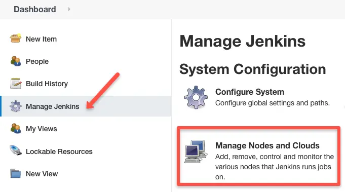
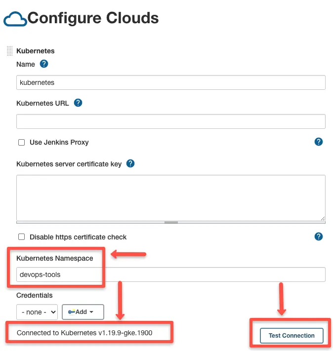
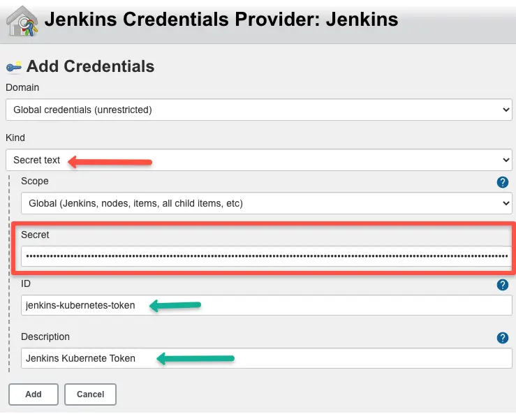
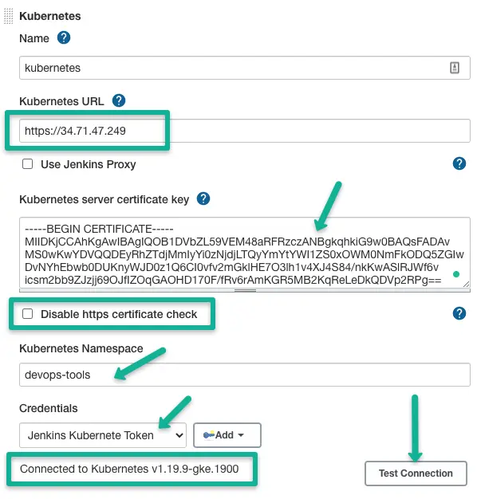
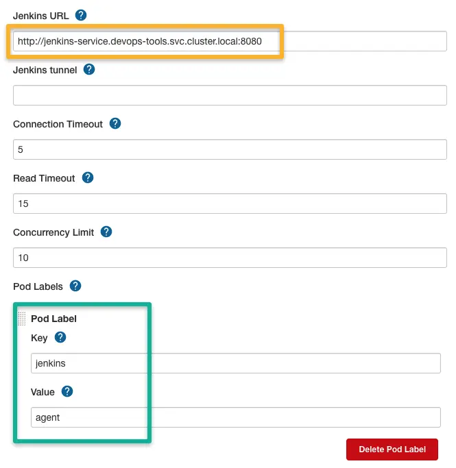
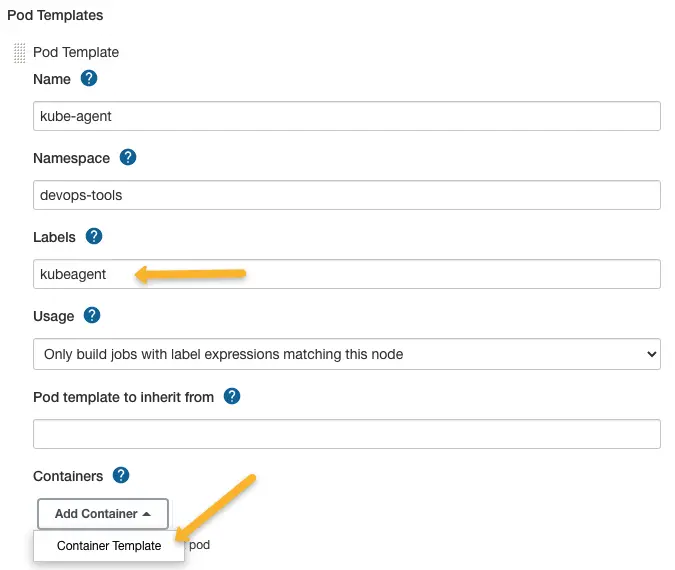

## jenkins in k8s

**前提：存在k8s集群**

### k8s中安装jenkins

#### 创建namespace

```yaml
apiVersion: v1
kind: Namespace
metadata:
  name: star-sky
  labels: 
  	devops.k8s.com/name: tools-dev
```


#### 创建service account及在当前namespace的角色及角色具有的权限

```yaml
apiVersion: v1
kind: ServiceAccount
metadata:
  name: star-admin
  namespace: star-sky
---
apiVersion: rbac.authorization.k8s.io/v1
kind: Role
metadata:
  name: jenkins-master
  namespace: star-sky
  labels:
    "app.kubernetes.io/name": 'jenkins-master'
rules:
- apiGroups: [""]
  resources: ["pods"]
  verbs: ["create","delete","get","list","patch","update","watch"]
- apiGroups: [""]
  resources: ["pods/exec"]
  verbs: ["create","delete","get","list","patch","update","watch"]
- apiGroups: [""]
  resources: ["pods/log"]
  verbs: ["get","list","watch"]
- apiGroups: [""]
  resources: ["secrets"]
  verbs: ["get"]
---
apiVersion: rbac.authorization.k8s.io/v1
kind: RoleBinding
metadata:
  name: jenkins-master-role-binding
  namespace: star-sky
roleRef:
  apiGroup: rbac.authorization.k8s.io
  kind: Role
  name: jenkins-master
subjects:
- kind: ServiceAccount
  name: star-admin
  namespace: star-sky
```

#### 创建storageclass及PVC

- 这里使用nfs provisioner来动态创建pv

##### 创建rbac

```yaml
#apiVersion: v1
#kind: ServiceAccount
#metadata:
#  name: nfs-client-provisioner
  # replace with namespace where provisioner is deployed
#  namespace: star-sky
#---
# sa 使用前面创建的star-admin
kind: ClusterRole
apiVersion: rbac.authorization.k8s.io/v1
metadata:
  name: nfs-client-provisioner-runner
rules:
  - apiGroups: [""]
    resources: ["nodes"]
    verbs: ["get", "list", "watch"]
  - apiGroups: [""]
    resources: ["persistentvolumes"]
    verbs: ["get", "list", "watch", "create", "delete"]
  - apiGroups: [""]
    resources: ["persistentvolumeclaims"]
    verbs: ["get", "list", "watch", "update"]
  - apiGroups: ["storage.k8s.io"]
    resources: ["storageclasses"]
    verbs: ["get", "list", "watch"]
  - apiGroups: [""]
    resources: ["events"]
    verbs: ["create", "update", "patch"]
---
kind: ClusterRoleBinding
apiVersion: rbac.authorization.k8s.io/v1
metadata:
  name: run-nfs-client-provisioner
subjects:
  - kind: ServiceAccount
    name: star-admin
    # replace with namespace where provisioner is deployed
    namespace: star-sky
roleRef:
  kind: ClusterRole
  name: nfs-client-provisioner-runner
  apiGroup: rbac.authorization.k8s.io
---
kind: Role
apiVersion: rbac.authorization.k8s.io/v1
metadata:
  name: leader-locking-nfs-client-provisioner
  # replace with namespace where provisioner is deployed
  namespace: star-sky
rules:
  - apiGroups: [""]
    resources: ["endpoints"]
    verbs: ["get", "list", "watch", "create", "update", "patch"]
---
kind: RoleBinding
apiVersion: rbac.authorization.k8s.io/v1
metadata:
  name: leader-locking-nfs-client-provisioner
  # replace with namespace where provisioner is deployed
  namespace: star-sky
subjects:
  - kind: ServiceAccount
    name: star-admin
    # replace with namespace where provisioner is deployed
    namespace: star-sky
roleRef:
  kind: Role
  name: leader-locking-nfs-client-provisioner
  apiGroup: rbac.authorization.k8s.io
```

##### 创建deployment

```yaml
apiVersion: apps/v1
kind: Deployment
metadata:
  name: nfs-client-provisioner
  labels:
    app: nfs-client-provisioner
  # replace with namespace where provisioner is deployed
  namespace: star-sky
spec:
  replicas: 1
  strategy:
    type: Recreate
  selector:
    matchLabels:
      app: nfs-client-provisioner
  template:
    metadata:
      labels:
        app: nfs-client-provisioner
    spec:
      serviceAccountName: star-admin
      containers:
        - name: nfs-client-provisioner
          image: k8s.gcr.io/sig-storage/nfs-subdir-external-provisioner:v4.0.2
          volumeMounts:
            - name: nfs-client-root
              mountPath: /persistentvolumes
          env:
            - name: PROVISIONER_NAME
              value: k8s-sigs.io/nfs-subdir-external-provisioner
            - name: NFS_SERVER
              value: 10.3.243.101
            - name: NFS_PATH
              value: /ifs/kubernetes
      volumes:
        - name: nfs-client-root
          nfs:
            server: 10.3.243.101
            path: /ifs/kubernetes
```

##### storageclass和PVC

```yaml
apiVersion: storage.k8s.io/v1
kind: StorageClass
metadata:
  name: nfs-client
provisioner: k8s-sigs.io/nfs-subdir-external-provisioner # or choose another name, must match deployment's env PROVISIONER_NAME'
parameters:
  archiveOnDelete: "false"
  #pathPattern: "${.PVC.namespace}/${.PVC.annotations.nfs.io/storage-path}" 
  pathPattern: "${.PVC.namespace}/jenkins"
---
kind: PersistentVolumeClaim
apiVersion: v1
metadata:
  name: jenkins-pvc
  namespace: star-sky
spec:
  storageClassName: nfs-client
  accessModes:
    - ReadWriteMany
  resources:
    requests:
      storage: 800Gi
```

#### jenkins deployment及service

```yaml
apiVersion: v1
kind: Service
metadata:
  name: jenkins-service
  annotations:
      prometheus.io/scrape: 'true'
      prometheus.io/path:   /
      prometheus.io/port:   '8080'
spec:
  selector: 
    devops.startsky.cn/name: jenkins-master1
  ports:
    - name: master
      port: 8080
      targetPort: 8080
    - name: agent
      port: 50000
      targetPort: 50000
---
apiVersion: apps/v1
kind: Deployment
metadata:
  name: jenkins-master1-deploy
  namespace: star-sky
  labels:
    app: jenkins-master1-deploy
spec:
  replicas: 1
  selector:
    matchLabels:
      app: jenkins-master1
  template:
    metadata:
      labels:
        app: jenkins-master1
        devops.startsky.cn/name: jenkins-master1
    spec:
      serviceAccountName: star-admin
      tolerations:
      - key: "node.kubernetes.io/unreachable"
        operator: "Exists"
        effect: "NoExecute"
        tolerationSeconds: 60
      - key: "node.kubernetes.io/not-ready"
        operator: "Exists"
        effect: "NoExecute"
        tolerationSeconds: 60
      terminationGracePeriodSeconds: 0
      containers:
      - name: jenkins-master1
        image: jenkinsci/blueocean:1.25.3-bcc31d32159f
        imagePullPolicy: IfNotPresent
        ports:
        - containerPort: 8080
          name: master
          protocol: TCP
        - containerPort: 50000
          name: agent
          protocol: TCP
        resources:
          limits: 
            cpu: "2"
            memory: 8Gi
          requests:
            cpu: 500m
            memory: 2Gi
        volumeMounts:
        - name: jenkins-home
          mountPath: "/var/jenkins_home"
        livenessProbe:
          httpGet:
            path: /login
            port: 8080
            httpHeaders:
            - name: Custom-Header
              value: healthz
          initialDelaySeconds: 60
          timeoutSeconds: 5
          failureThreshold: 12
        readinessProbe:
          httpGet:
            path: /login
            port: 8080
          initialDelaySeconds: 60
          timeoutSeconds: 5
          failureThreshold: 12
      securityContext:
        fsGroup: 1000
        runAsUser: 1000
      volumes:
      - name: jenkins-home
        persistentVolumeClaim:
          claimName: jenkins-pvc
```

部署上面yaml文件


### 安装jenkins kubernetes plugin

#### 查看初始化密码

```shell
cat ${NFS_dir}/star-sky/jenkins/{pv-name}/secrets/initAdminPassword
```

选择安装推荐插件，进入页面


#### 进入安装

Manage Jenkins -> Manage Plugins -> Available -> Kubernetes plugin 勾选安装


Manage Jenkins —> Configure System —> (拖到最下方)Add a new cloud —> 选择 Kubernetes




#### 配置

##### jenkins部署在k8s集群内

直接使用sa部署agent pod，无需配置URL或证书；点解测试连接按钮验证pod是否能访问k8s api server的api

填写namespace，选择集群



##### jenkins部署在k8s集群外

- k8s url，支持https填https
- k8s server certificate key，没有就disable https certificate check，pod中/var/run/secrets/kubernetes.io/serviceaccount/ca.crt
- Credentials，namespace中sa的token

```shell
SECRET_NAME=$(kubectl get serviceaccount star-admin  -o=jsonpath='{.secrets[0].name}' -n star-sky)
kubectl get secrets $SECRET_NAME  -o=jsonpath='{.data.token}' -n devops-tools | base64 -D
```





##### 配置jenkins的详细url

```http
http://<service-name>.<namespace>.svc.cluster.local:8080
```



##### 创建pod和container模版



如果没有配置container template，jenkins默认使用JNLP镜像jenkins/inbound-agent，确保删除sleep: 999999默认参数

在pipeline中可以定义多个container


[参考连接](https://devopscube.com/jenkins-build-agents-kubernetes/)

[jenkins官网](https://plugins.jenkins.io/kubernetes/)

